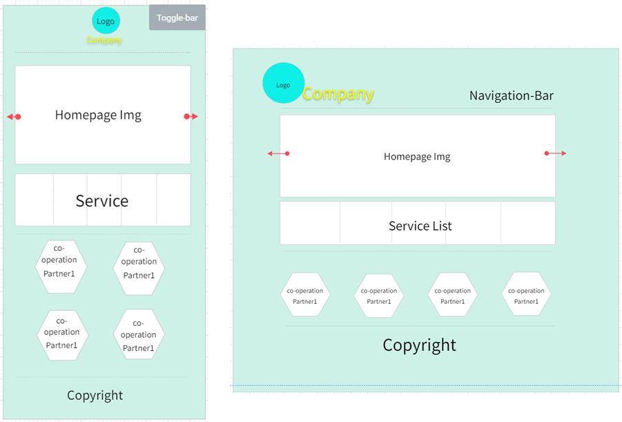
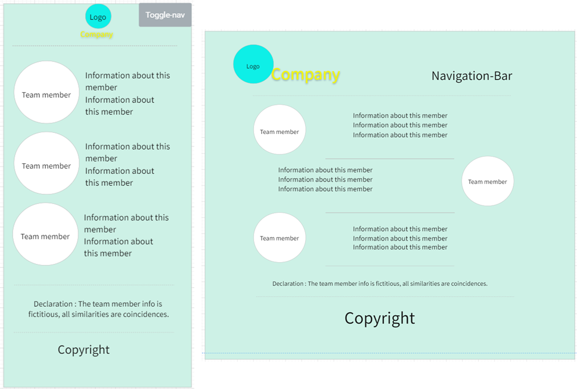
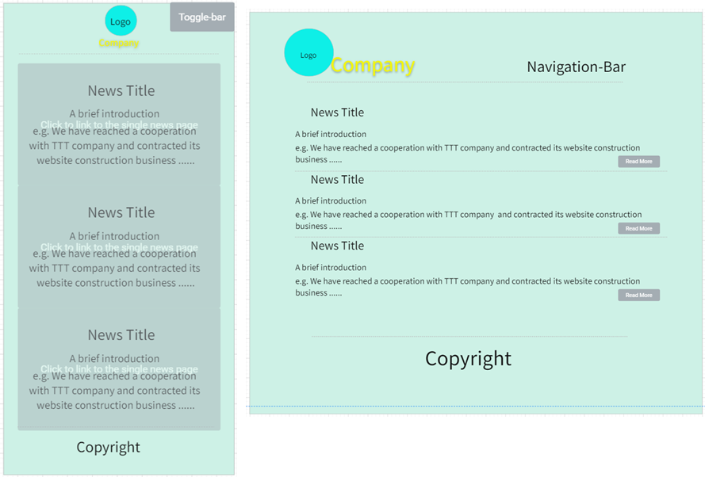

## Planning & Design
### ***Jun Zhang***

#### Introduction
This web program is design by html, CSS, JavaScript and Canvas which using ‘Mobile First Responsive Web Design’. Which is a official website of a Software Outsourcing Company named ‘Yo! Troy’.

#### General ethos
An outsourcing company is a company that undertakes third-party software design and development services. This topic is closely related to computer science. And that kind of companies really need a website online to get more orders and be famous.

#### Site Map
 
Clean, concise site map will give user the sense with clear thinking. Most factors are necessary for an official website. First-level menus get more information to make PC view compact than divide them into more pages, and it also makes the content of a single page full. News page have second-level page for every content.
#### Accessibility
##### Compatibility
This website support users on mobile devices and different resolution devices such as desktop computers, TVs.

##### Readability
User is able to navigate through a screen reader that see the value of each attribute. Adding Image alt and A title, text can substitute for the general alternative of page content.
##### High efficiency
Optimized the website loading speed and supports low-configuration devices.

Consider to provide screen magnifiers for low vision people, and the similar function like control text size. Supporting night mode for benefit reading in the night. 

#### Legal issues
The trademarks or pictures involved in the website are from the license-free website or original, and follow the Attribution 4.0 International (CC BY 4.0).  Some Information from this website is fictitious, all similarities are coincidences.
#### Design mock-ups
##### Basic Structure
The views of header and footer in PC or mobile are fixed, so the basic structure will be quote into most pages with different content. The picture will show below.

*Mobile*:	The company logo and name will be the top center and in center-view which is different with PC. And the copyright will be the button center by one sentence.

*PC*:  The company logo and name will float on the top left; the navigation bar will be the top right. And the copyright will follow the mobile view.

There will be one breakpoint for every single page to differentiate mobile and other equipment with bigger screen resolution.

##### Content
###### *Body of ‘Home’ page*

There will be a single image background or large carousels. Then turn to company service for user and show some experience for co-operation partner to increase company credibility.

*Mobile*: Display factors according to the resolution of different devices in different resolution.

###### *Body of ‘Team’ page*

###### *Body of ‘News’ page*

There will be three news as example.
*Mobile*: user can click every board to link to the single news page.
*PC*: Click the Title or ‘Read More’ to link to each content.
###### *Body of ‘Contact Us’ page*

###### *Body of ‘Accessibility’ page*
Include declaration content about Compatibility, Readability and high efficiency for this website.
#### Menu System
Use toggle navigation to link pages in mobile view, it saves space for mobile screen. For PC view, just list every link to top right that compose the navigation bar, Emphasize the simplicity and legibility of pages.
