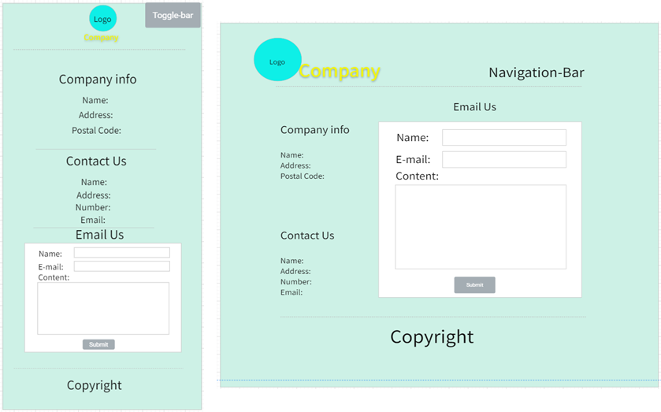

## Planning & Design

#### Introduction
This web program is design by html, CSS, JavaScript and Canvas which using ‘Mobile First Responsive Web Design’. Which is an official website of a Software Outsourcing Company named ‘Yo! Troy’.

#### General ethos
An outsourcing company is a company that undertakes third-party software design and development services. This topic is closely related to computer science. And that kind of companies really need a website online to get more orders and be famous.

#### Site Map
 
Clean, concise site map will give user the sense with clear thinking. Most factors are necessary for an official website. First-level menus get more information to make PC view compact than divide them into more pages, and it also makes the content of a single page full. News page have second-level page for every content.
#### Accessibility
##### Compatibility
This website support users on mobile devices and different resolution devices such as desktop computers, TVs.

##### Readability
User is able to navigate through a screen reader that see the value of each attribute. Adding Image alt and A title, text can substitute for the general alternative of page content.
##### High efficiency
Optimized the website loading speed and supports low-configuration devices.

Consider providing screen magnifiers for low vision people, and the similar function like control text size. Supporting night mode for benefit reading in the night. 

#### Legal issues
The trademarks or pictures involved in the website are from the license-free website or original, and follow the Attribution 4.0 International (CC BY 4.0).  Some Information from this website is fictitious, all similarities are coincidences.
#### Design mock-ups
##### Basic Structure
The views of header and footer in PC or mobile are fixed, so the basic structure will be quoted into most pages with different content. The picture will show below.

*Mobile*:	The company logo and name will be the top center and in center-view which is different with PC. And the copyright will be the button center by one sentence.

*PC*:  The company logo and name will float on the top left; the navigation bar will be the top right. And the copyright will follow the mobile view.

There will be one breakpoint for every single page to differentiate mobile and other equipment with bigger screen resolution.

##### Content
###### *Body of ‘Home’ page*

There will be a single image background or large carousels. Then turn to company service for user and show some experience for co-operation partner to increase company credibility.

*Mobile*: Display factors according to the resolution of different devices in different resolution.

###### *Body of ‘Team’ page*

###### *Body of ‘News’ page*

There will be three news as example.
*Mobile*: user can click every board to link to the single news page.
*PC*: Click the Title or ‘Read More’ to link to each content.
###### *Body of ‘Contact Us’ page*

###### *Body of ‘Accessibility’ page*
Include declaration content about Compatibility, Readability and high efficiency for this website.
#### Menu System
Use toggle navigation to link pages in mobile view, it saves space for mobile screen. For PC view, just list every link to top right that compose the navigation bar, Emphasize the simplicity and legibility of pages.

## Development & Testing

#### Changes
##### Change of Basic Structure
Put declaration into footer tag in every single page, because every page have factitious information.
Mobile: Toggle-navigation for showing the menu in mobile view may base on extra frameworks. Put the menu at the button can lead user reading full content first, but still rest the toggle button at the top-right, it will link to the button menu.

##### Change of ‘Home’ page

Remove the ‘Homepage Img’ carousel. Home page consist many image tags for company service or partner rather than text. On the mobile views will be slightly bloated.
Separate every single service, good for compatible with different resolutions. Conjoint view is good-looking in mobile equipment but looks stingy in PC view.
Shows different co-operation companies’ logo in different view. This is for better page layout.

##### Change of ‘News’ page
Cover picture make this page rich and colorful.
User should click cover picture or title to redirect to the single page, not every board. Reduced the probability of false touches in the mobile.

Adding overflow to limit word count in news page, make same size of every wrapper.
 
PC: redesign the pc view because of the use of cover picture, as similar as mobile.

##### Change of news content page
Cover picture added.
More information like author and date.
Add ‘back’ function.

#### Organisation
The template of HTML is into the header and footer tag, and it should be uniform in every page. Such as the website logo, navigation, copyright. Only the Body as main content are different. 

The template of CSS is the ‘index.css’ which suit for the template of HTML, it is created to cover the functions included in each website and reduce the total size of the project.

Put image, JavaScript and CSS file in their own folder. The pictures are also classified according to the webpage which contains same type images on the single page. And single news page in ‘news’ folder, reflecting the generation relationship.

The web DevTools is build-in the browser (Edge) inspect. It could be use to testing then optimize and improve work.

#### Optimisation
All pictures use Portable Network Graphic format, .png could be lossless optimized to same store, boost website access speed.
Server-side includes (SSI) cannot be used on this page via localhost. Therefore, single page should include the whole structure.

#### Security
Website do not interact with online server independently. The form will only post to the local software and information will be shown on the box. It does not need to encrypt.
Other factors are safety offline cause there’s no network interaction.

#### Debugging
The HTML and CSS code has been debugging by validator. Except for special spelling errors that are caused of misjudgments by the validators, there are no other errors.

#### Testing
The test tool is from Edge browser, it has 4 aspects of web design standard. and the score will show below.

The image issue from news page and news content page is because the text. The news content is not enough, if the picture is reduced, the text overflow cannot be displayed.

